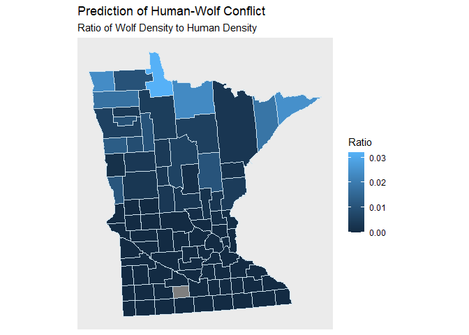
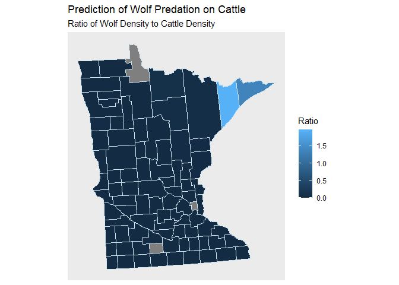

# Predicting Human- Animal Conflict in Minnesota

Kameron Knoll, Emily Carpenter, and Taylor Gardin 1

1 Biosciences Department, Minnesota State University Moorhead

### Abstract

In Minnesota, the wolf population has been on the rise for the last few
decades. More recently, the Minnesota Department of Natural Resources’
Division of Fish and Wildlife (DNR) has raised questions regarding the
overall wolf population, management and behaviors. Additionally, further
questions came to surface when cattle and human populations were
included. The purpose was to analyze wolf behaviors when they are
presented with potential conflicts. For this research, data was
collected from the DNR, Minnesota State Demographic Center and the
Minnesota Department of Agriculture. By analyzing the data, we were able
to reach predictions of potential predation by wolves. After comparing
the densities of the populations by districts and counties, conclusions
were able  to be reached. In the state maps provided, the counties with
the lighter blue are areas where there is a higher risk of predation and
conflict between the stated groups. 

-   3-5 bullet points

-   10-15 words per bullet

### **Introduction**

In the 1960’s, the wolf population in Minnesota was only around 400
wolves. Within the past 40 years, thanks to wildlife biologists, the
population has soared to an estimated 2,400 in 2020. Making sure
populations are stable is a major way to help ecosystems thrive in the
wild. However, what happens when humans are part of that
ecosystem. Human-wildlife conflict is when encounters between humans and
wildlife end in negative results, such as loss of property, livelihoods,
or even life. With the rise in population of wolves in the past couple
of decades  there has also been a rise in trapping and killing of  the
animals to keep people and livestock safe.(Mech D.) What if we could
predict where conflict take place in Minnesota between humans and
wolves? That is what is done in this exploratory data analysis. By
looking at wolf population, human population, and cattle population we
hope to find some pattern as to where we should see human wolf conflict
in Minnesota.

### **Methods**

The wolf population data was obtained from the Minnesota Wolf
Population update 2020, documented by the Minnesota DNR. The cattle
population data was obtained from a survey recorded by the USDA, and the
human population data was taken from Minnesota State Demographic
Center’s website. Once the data was organized on excel spreadsheets the
data was uploaded, combined, and reorganized using RStudio. Continuing
the use of RStudio several graphs were created to display the data in
order to find correlation. First, scatterplots were made showing wolf to
human population, and wolf to cattle population. The second batch came
in the form of maps showing density of our data. Using the ‘ubrmrp’
program, we calculated wolf population/miles squared, human
population/miles squared, and cattle population/miles squared to get the
densities per county for each data set. Once these were calculated, we
created maps showing the ratio of densities compared over each other.

### **Results**

Looking at Figure 1, which shows the wolf population vs the human
population in each county. This data showed no correlation between the
two populations. Our line of best fit gave no real indication as to
which way our data sways. When we created a scatterplot of the wolf
population to cattle population it yielded the same results. The
scatterplot showed no true correlation with our numbers being all over
the board. Looking at the densities of each data point and mapping,
those numbers yielded some possible answers. In figure 2, we took the
wolf density over the human density and mapped it out. It is shown that
in the lighter blue areas in the northern part of the state is where we
would expect to see human wolf conflict. In the middle and southern part
of the state, that is shown in dark blue, there is a lower chance of
seeing human wolf conflict. In figure 3, we mapped out the wolf density
to the cattle density and found that there could be a chance of conflict
in the northeastern part of the state in Cook and Lake counties. With
the rest of the state having virtually no chance for conflict. They gray
areas show where we had no data for cattle or wolves.

-   Main result number Main result number one (fig. 1)one (fig. 1)

-   Main result number one (fig. 2)

<!-- -->

<!-- -->

### **Discussion**

The results of this exploratory data analysis are very interesting.
Within figure 2 we would expect to see more human wolf conflict in the
northern counties, or the lighter blue hues of the ratio scale, because
the density ratio of wolves to humans is higher than in the southern
portion of Minnesota. The further south you go the human population
increases, and the wolf population decreases. Also, the wolf’s territory
range only goes as far south as Chisago county. That is why the
southernmost portion of  the map displays zero display of ratio
densities.  With the wolf and cattle map, we see the light blue area
where we expect to see conflict are only in Cook and Lake counties.Most
of the livestock in Minnesota are in the southern part of the state, and
since wolves are in the northern part this explains why there is only
predicted conflict in the northeastern tip. It is the only area
where the two populations meet. The significance of this exploratory
data analysis is that these data sets have never been brought together
before. Residents’ attitudes on wolves are a little controversial
depending on if you are a hunter, livestock owner, or just a
resident(Schroeder). However, they do agree on a few things, wolves are
a danger to pets, livestock, and the white-tailed deer population. 
According to the DNR in 2019, wolves killed 74 calves, 11 cows, 2 sheep,
and 2 dogs. From 2014 to 2018 the Minnesota Department of Agriculture
made annual depredation payment of $150,000 to livestock producers.
Residents also agree that maintaining wolves’ numbers and range in
Minnesota is important(Schroeder).The residents of Minnesota enjoy
having the wolf populations around and take pride in the fact that our
state has made it a priority. They also care that the population is
managed. The DNR has had a firm grip on management as the wolf numbers
continue to rise. If the numbers get out of control our data could help
find where it would be best to institute a hunting or trapping season
for wolves in Minnesota. The data could also help relocate wolves that
have attacked livestock. In almost every case when a wolf is relocated
it never comes back to the offending area(Michael W. Fox). The research
we have done here could assess the dangers of the wolf population
getting too high and ensuring the safety of Minnesota’s residents.

### **Conclusion**

By comparing the data sets and calculating the densities of cattle,
wolf, and human populations within the state of Minnesota, we were able
to locate the areas of higher risk of predation and conflict. Between
wolves and cattle, the county with the highest risk is Saint Louis,
which is located near the Northshore. Wolf and human conflict is highest
in the northern counties of Minnesota– especially Lake of the Woods.
This information could be used in several ways to better help safety
between humans and wolves while keeping the population at a manageable
level.

### **References**

1.  Erb J, Humpal C. 2020. Minnesota Wolf Population Update 2020.
    Minnesota Department of Natural resources. \[accessed 2022 Mar 22\].
    [https://files.dnr.state.mn.us/wildlife/wolves/2020/survey-wolf.pdf.​](https://files.dnr.state.mn.us/wildlife/wolves/2020/survey-wolf.pdf.​)

2.  Lofthus D, Tiffany Byrne. 2020. Agricultural Statistics Annual
    Bulletin. Peterson T, editor. Minnesota Department of Agriculture.
    \[accessed 2022 Mar 16\].
    [https://www.nass.usda.gov/Statistics_by_State/Minnesota/Publications/Annual_Statistical_Bulletin/2020-MN-Bulletin.pdf.​](https://www.nass.usda.gov/Statistics_by_State/Minnesota/Publications/Annual_Statistical_Bulletin/2020-MN-Bulletin.pdf.​)

3.  Martin, J. V., Epstein, K., Anderson, R. M., & Charnley,
    S. Coexistence Praxis: The Role of Resource Managers in
    Wolf-Livestock Interactions on Federal Lands (2021). Frontiers in
    Conservation
    Science, 2. <https://doi.org/10.3389/fcosc.2021.707068> ​

4.  Mech D. 2001. Managing Minnesota’s Recovered Wolves. Wiley.
    29(1):70–77. \[accessed 2022 Mar 20\].
    [https://www.jstor.org/stable/pdf/3783982.pdf.​](https://www.jstor.org/stable/pdf/3783982.pdf.​)

5.  Minnesota State Demographic Center. 2019. Our Estimates.
    <https://mn.gov/admin/demography/data-by-topic/population-data/our-estimates/> ​

6.  Schroeder, S. A., Landon, A. C., Cornicelli, L., McInenly, L., &
    Stark, D. (2020). Minnesotans’ attitudes toward wolves and wolf
    management. University of Minnesota, Minnesota Cooperative Fish and
    Wildlife Research Unit, Department of Fisheries, Wildlife, and
    Conservation Biology.​

7.  Wolves And Human Well-being: Ecological & Public Health Concerns \|
    Dr. Michael W. Fox. drfoxonehealthcom. \[accessed 2022

### GitHub Documents

This is an R Markdown format used for publishing markdown documents to
GitHub. When you click the **Knit** button all R code chunks are run and
a markdown file (.md) suitable for publishing to GitHub is generated.

## Including Code

You can include R code in the document as follows:

## Including Plots

You can also embed plots, for example:

<!-- -->

Note that the `echo = FALSE` parameter was added to the code chunk to
prevent printing of the R code that generated the plot.
